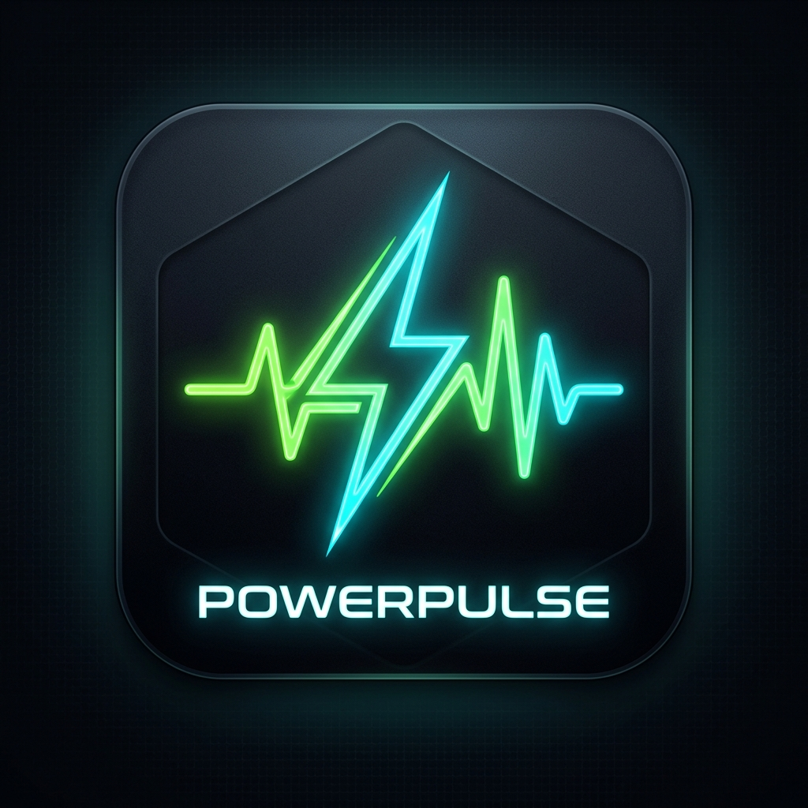

<div align="center">
  
  <h1>⚡ POWER_PULSE // CYBER_VOLT v4.2</h1>
  <p><b>Real-Time Hardware Power Draw, Network Speed & Electricity Billing Cockpit</b></p>
</div>

<div align="center">

[](LICENSE)
[](.)
[](mac_widget/)
[](.)
[](https://github.com/yahiabinzaman)

</div>

A professional, zero-dependency, cyberpunk-themed hardware telemetry monitor and real-time electricity billing calculator for **macOS (Apple Silicon M1-M4 & Intel)** and **Windows (10/11)**. Includes a **Native macOS Menu Bar Status Widget** (`PowerPulseBar.app`) and a responsive **Web IDE Cockpit**.

---

## 🌟 Key Features

### 1. ⚡ Real-Time Hardware Power Draw Engine
- Live system wattage measurement updated every **1000ms**.
- Fine-grained power allocation across:
  - **CPU Package Workload** (Scaled to SoC TDP curves).
  - **GPU & Neural Engine Acceleration** (Photoshop, Illustrator, Metal/DirectX rendering).
  - **DRAM & SoC Motherboard Base Load**.
- Real-time Min, Average, and Peak power tracking.

### 2. 🌐 Live Internet Speed Radar & ISP Speedtest Benchmark
- **Live Download & Upload Throughput**: Real-time bandwidth monitoring in **Mbps** and **KB/s**.
- **Ping / Latency RTT**: Real-time network round-trip time in milliseconds (**ms**).
- **Session Total Network I/O**: Tracks total data transferred during the session.
- **On-Demand ISP Speedtest Benchmark**: One-click multi-stream CDN speedtest (`[SPEEDTEST]`) measuring peak connection throughput.

### 3. 💰 Electricity Cost & Tariff Projection Matrix
- Dynamic cost calculation:
  - **Hourly Rate** (e.g. `৳ 0.17 / hr`)
  - **24-Hour Cycle** (e.g. `৳ 4.08 / day`)
  - **Monthly Projection (30 Days)** (e.g. `৳ 122.42 / mo`)
- Configurable currency symbols (**৳ BDT**, **$ USD**, **€ EUR**, **₹ INR**, **£ GBP**, **AED**).
- One-click area tariff presets (e.g. **Motijheel DPDC Commercial/Office ৳10.55/unit**, **Motijheel Peak Slab ৳14.11/unit** with +5% VAT).

### 4. 🍎 Native macOS Status Bar Widget (`PowerPulse.app`)
- 100% native Swift application running directly in your Mac's top Menu Bar.
- **Configurable Live Telemetry**:
  - `Full`: `14.8W | CPU 32% | RAM 65% | 1.2M`
  - `RAM in GB`: `14.8W | CPU 32% | RAM 10.4G`
  - `Watts + Net`: `14.8W | 1.2M`
  - `Watts Only`: `14.8W`
- **Self-Healing Engine**: Automatically spawns background server if port is closed; local zero-latency fallback ensures the status bar **never goes offline**.
- **Persistent Auto-Start**: Registers as a macOS LaunchAgent daemon (`~/Library/LaunchAgents/com.yahiabinzaman.powerpulse.plist`) that automatically launches on login and persists across computer restarts/reboots.

### 5. 🚀 Active Application Power Disassembly
- Live process table tracking active applications (Chrome, Adobe Illustrator, Photoshop, IDEs, System Compositor).
- Displays PID, Application Name, Category, CPU%, RAM (MB), Estimated Watts, Hourly Cost, and Load status (`ECO`, `MED`, `HEAVY`).

---

## 🚀 Quick Start & Installation

### 🍎 Option 1: macOS One-Click `.DMG` Installer / Script
1. **Via DMG Disk Image**:
   - Double-click [`PowerPulse-Installer.dmg`](PowerPulse-Installer.dmg).
   - Drag **`PowerPulse.app`** into your **`Applications`** folder.
2. **Via Automated Script**:
   ```bash
   ./install_mac.sh
   ```
   - Automatically builds DMG, installs to `/Applications/PowerPulse.app`, and configures **Persistent Auto-Start on Boot**.

### 🪟 Option 2: Windows 100% Virus-Free One-Click Setup
Double-click [`PowerPulse_Setup_Windows.bat`](PowerPulse_Setup_Windows.bat) or run:
```cmd
PowerPulse_Setup_Windows.bat
```
- **100% Virus-Free**: Uses clean PowerShell & VBScript background launcher without raw unsigned binary wrappers that trigger Windows Defender false positives.
- Installs to `%LocalAppData%\PowerPulse`.
- Creates Desktop Shortcut (`PowerPulse.lnk`).
- Adds to Windows Startup for automatic background telemetry on boot.

### 🌐 Option 3: Manual Launch (Web Dashboard Only)
**On macOS**:
```bash
./run_mac.sh
```

**On Windows**:
```cmd
run_windows.bat
```

Open your browser at: **`http://127.0.0.1:8765`**

---

## ⚙️ Configuration

Click the **`[CONFIG // TARIFF]`** button in the top bar to:
- Select area tariff presets (Motijheel DPDC, DESCO, or Custom).
- Enter custom per-unit electricity rates.
- Toggle +5% Bangladesh Government Electricity VAT.
- Adjust telemetry refresh rates (1.0s, 2.0s, 3.0s).

---

## 👨‍💻 Author & Credits

- **System Architect & Developer**: **Yahia Bin Zaman**
- **GitHub**: [github.com/yahiabinzaman](https://github.com/yahiabinzaman)
- **Facebook**: [facebook.com/yahiabinzaman](https://www.facebook.com/YahiaBinZaman/)
- **System**: CYBER_VOLT Core v4.2 Telemetry Engine

---

## 📄 License

This project is licensed under the MIT License - see the [LICENSE](LICENSE) file for details.
